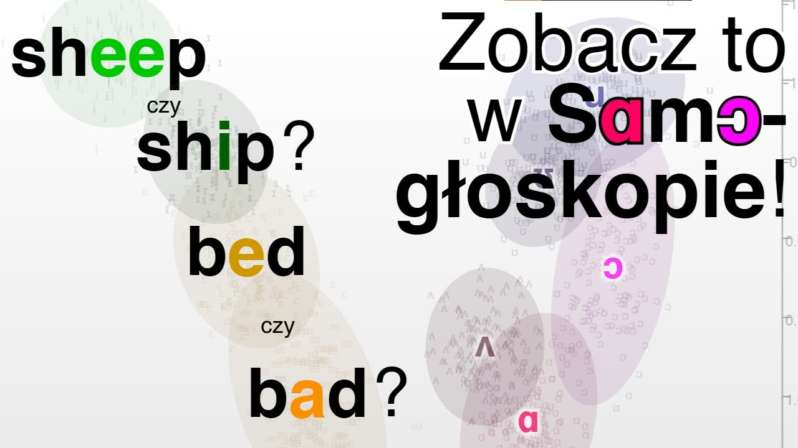

# Samogłoskop

W tym repozytorium znajduje się kod źródłowy aplikacji webowej stworzonej przeze mnie w ramach mojej [pracy magisterskiej pt. *Identyfikacja dźwięku w przestrzeni samogłosek w czasie rzeczywistym*](https://ogoras.github.io/samogloskop/samogloskop_magisterka.pdf). Wiele szczegółów nieopisanych tutaj znajduje się w samej pracy magisterskiej.

[LINK DO APLIKACJI WEBOWEJ](https://ogoras.github.io/samogloskop/)

### Demonstracja wideo

## Stos technologiczny

Cała aplikacja została napisana w języku JavaScript/TypeScript z użyciem wymienionych narzędzi i bibliotek:
- algorytmy wydobywania formantów programu [Praat](https://github.com/praat/praat), które własnoręcznie przeniosłem do JavaScriptu,
- [emlapack](https://github.com/likr/emlapack), czyli [CLAPACK](https://www.netlib.org/clapack/) w wersji skompilowanej do WebAssembly,
- [D3.js](https://d3js.org/),
- [math.js](https://mathjs.org/).

Analizę danych zebranych podczas badania przeprowadziłem głównie w języku Python z użyciem bibliotek NumPy, Pandas i statsmodels. Część wykresów wykonałem w zmodyfikowanej wersji aplikacji webowej, co można zobaczyć na gałęzi [data_processing](https://github.com/ogoras/samogloskop/tree/data_processing).

## Funkcje aplikacji

Program wyposażony jest w wiele modułów, pozwala na:
- wyodrębnianie formantów i przedstawianie ich na wykresie w czasie rzeczywistym,
- pokazanie na tym samym wykresie samogłosek modelowej wymowy, a także z poprzednich nagrań użytkownika,
- wybór reprezentacji lub całkowite schowanie powyższych zbiorów danych,
- skupienie na pojedynczej samogłosce po kliknięciu na jej reprezentację,
- zobaczenie przykładowych słów z samogłoską, wraz z transkrypcją i użyciem w zdaniu,
- odsłuchanie nagrań polityków dla wybranych słów,
- kalibrację do głosu użytkownika i poziomu szumu,
- zautomatyzowanie badań, w tym losowe przydzielanie do grupy kontrolnej/badawczej oraz prowadzenie testów wymowy z zapisem formantów,
- wybór kategorii głosu (kobieta, mężczyzna, dziecko),
- zapis stanu aplikacji do pliku i wczytywanie go później,
- śledzenie czasu spędzonego na ćwiczeniu z podziałem na dni.